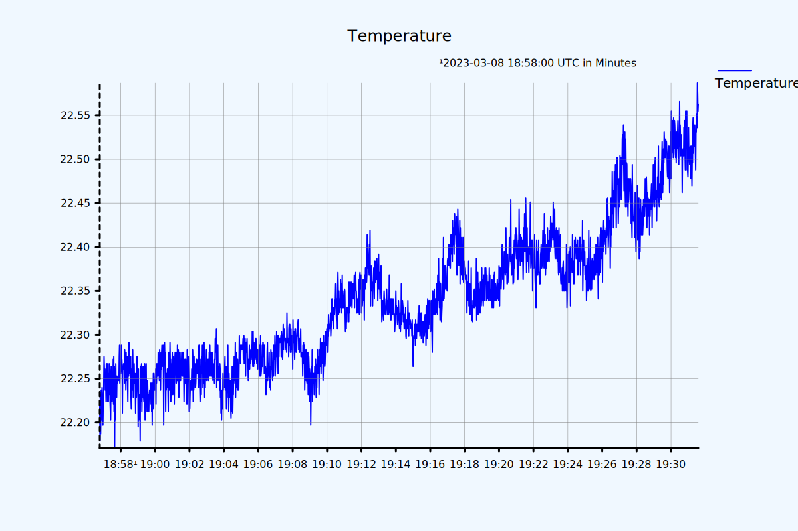

# Demo Application for ESP32-C3-DevKit-RUST

A simple STD binary for the development board [ESP32-C3-DevKit-RUST](https://github.com/esp-rs/esp-rust-board).

**Features**
- Control of RGB LED
- Temperature and humidity measurement (via SHCT3 sensor)
- Webserver that shows svg plots of temperature and humidity

**Example plot** (thanks to [poloto](https://crates.io/crates/poloto) crate)  


## Getting Started

```
export ESP32_DEMO_WIFI_SSID=<ssid>
export ESP32_DEMO_WIFI_PASS=<password>
cargo espflash flash --release --target riscv32imc-esp-espidf --baud 921600 --monitor 
```

After flashing the ESP32 will provide a webserver that generates plots of the measured temperature and humidity. Open `<ip>/temperature` or `<ip>/humidity` in your webbrowser.

## Prerequisites

```
sudo apt install -y pkg-config libudev-dev clang python3-virtualenv
rustup install nightly
rustup component add rust-src --toolchain nightly
cargo install ldproxy
cargo install cargo-espflash
```
see also: https://github.com/esp-rs/esp-idf-template#prerequisites

# Further Reading
- https://github.com/ivmarkov/rust-esp32-std-demo
- https://github.com/esp-rs/espressif-trainings
- https://esp-rs.github.io/espressif-trainings/01_intro.html